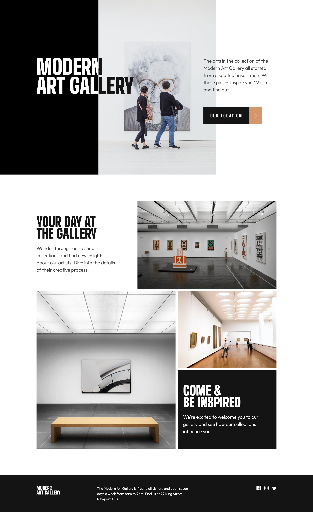

# Frontend Mentor - Art gallery website solution

This is a solution to the [Art gallery website challenge on Frontend Mentor](https://www.frontendmentor.io/challenges/art-gallery-website-yVdrZlxyA). Frontend Mentor challenges help you improve your coding skills by building realistic projects.

## Table of contents

- [Overview](#overview)
  - [The challenge](#the-challenge)
  - [Screenshot](#screenshot)
  - [Links](#links)
- [My process](#my-process)
  - [Built with](#built-with)
  - [What I learned](#what-i-learned)
  - [Continued development](#continued-development)
  - [Useful resources](#useful-resources)
- [Author](#author)
- [Acknowledgments](#acknowledgments)

**Note: Delete this note and update the table of contents based on what sections you keep.**

## Overview

### The challenge

Users should be able to:

- View the optimal layout for each page depending on their device's screen size
- See hover states for all interactive elements throughout the site
- **Bonus**: Use [Leaflet JS](https://leafletjs.com/) to create an interactive location map with custom location pin

### Screenshot



### Links

- Solution URL: [Github](https://github.com/graficdoctor/fe-16-art-gallery-website)
- Live Site URL: [Vercel](https://fe-16-art-gallery-website.vercel.app/)

## My process

### Built with

- Semantic HTML5 markup
- CSS custom properties
- Flexbox
- CSS Grid
- Mobile-first workflow

### What I learned

Solution for the black/white colour of the title: adding a `clip-path` to the `<h1>`:

```css
.fb-col-wrapper {
	position: relative;
}

.header-text h1 {
	position: relative;
}

.header-text h1::before {
	content: 'Modern Art Gallery';
	position: absolute;
	top: 0;
	left: 0;
	color: hsl(var(--clr-100));
	z-index: 1;
	clip-path: polygon(0 0, 54% 0, 54% 100%, 0 100%);
}
```

### Continued development

Use this section to outline areas that you want to continue focusing on in future projects. These could be concepts you're still not completely comfortable with or techniques you found useful that you want to refine and perfect.


### Useful resources

- [What do you name color variables?](https://css-tricks.com/what-do-you-name-color-variables/) - I like using variables but up until now I wasn't always using the same naming-convention. I looked it up on CSS Tricks and came across a link to [Material Design](https://material.io/design/color/the-color-system.html#color-theme-creation) where the same naming-convention is being used like I was aiming for. Bookmarked the site thus.
- [Images On The Web](https://www.youtube.com/watch?v=2QYpkrX2N48&t=0s)

## Author

- Website - [Katrien S](https://www.katriens.be)
- Frontend Mentor - [@katrien-s](https://www.frontendmentor.io/profile/katrien-s)

## Acknowledgments

This is where you can give a hat tip to anyone who helped you out on this project. Perhaps you worked in a team or got some inspiration from someone else's solution. This is the perfect place to give them some credit.
